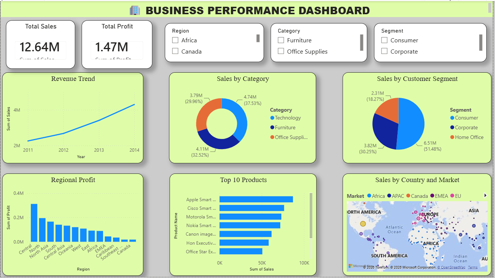

# 📊 Business Performance Dashboard using Power BI

## Project Overview

This project is an interactive Power BI dashboard developed to analyze sales performance. The dashboard provides meaningful insights through KPIs, charts, and filters, helping users understand sales trends and business performance.

---

## Dashboard Preview

---

## Features

- Total Revenue KPI
- Total Profit KPI
- Sales Trend Analysis
- Sales by Category
- Sales by Region
- Interactive Filters (Slicers)
- User-friendly Dashboard Design

---

## Dataset

- Source: Sales Dataset
- Format: CSV
- Records: (Mention the number of rows if known)

---

## Tools Used

- Power BI Desktop
- Microsoft Excel / CSV
- GitHub

---

## Files Included

- Dashboard.pbix
- sales_data.csv
- dashboard.png
- README.md

---

## Author

Devak G
